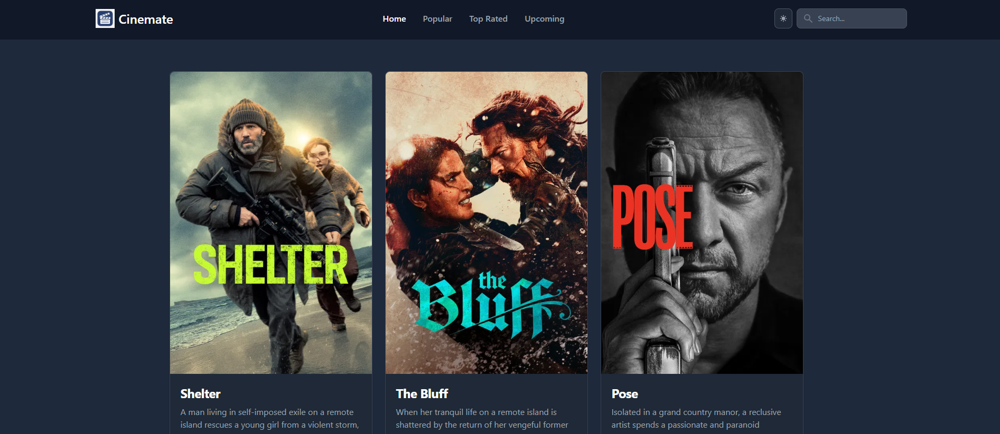
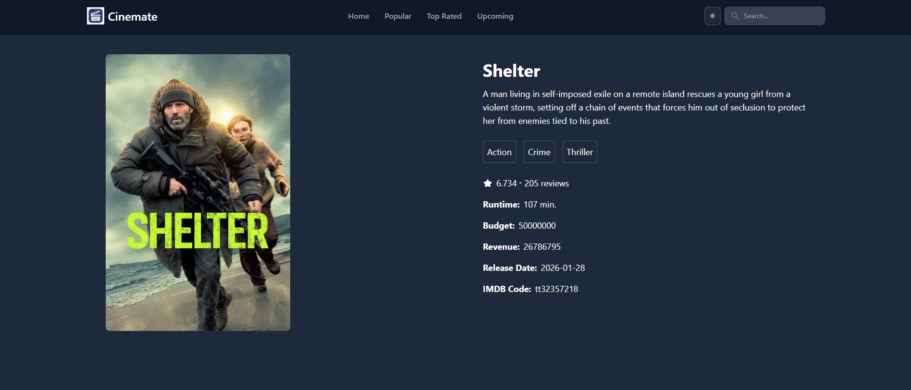
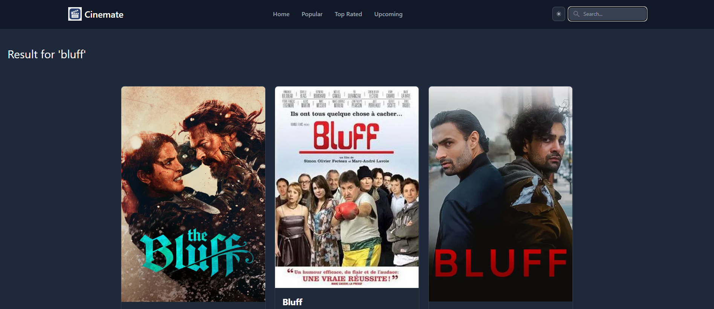

# 🎬 Cinemate

A modern **movie browsing web application** built with **React** and **Tailwind CSS**, inspired by BookMyShow.  
Explore movies, see details, and enjoy a smooth, responsive cinematic UI.

🔗 **Live Demo:** [https://cinemate-bookmyshow.netlify.app/](https://cinemate-bookmyshow.netlify.app/)

---

## 🖼 Screenshots

### Homepage


### Movie Details Page


### Search Functionality



---

## 🚀 Features

- **Browse Movies** – View a collection of movies with posters and titles.  
- **Movie Details** – Click on a movie to see overview, rating, release date, and genres.  
- **Search Functionality** – Search movies by name with instant results.  
- **Responsive Design** – Works smoothly on desktop, tablet, and mobile screens.  
- **Modern UI with Tailwind CSS** – Clean, visually appealing, and user-friendly interface.  
- **Routing with React Router** – Seamless navigation between homepage and movie details.  
- **Header & Footer Components** – Consistent layout across pages.  
- **Dynamic Movie Data** – Fetches movie data from a movie API (TMDB) in real-time.

---

## 🧰 Tech Stack

- **Frontend:** React  
- **Styling:** Tailwind CSS  
- **Routing:** React Router DOM  
- **API:** TMDB 
- **Deployment:** Netlify  

---

## 🛠 Installation & Setup

1. **Clone the repository**
   ```bash
   git clone https://github.com/shital1223/Front-End-Projects.git

2. **Navigate to the Cinemate project**
   ```bash
   cd Front-End-Projects/React/cinemate
   
3. **Install dependencies**
   ```bash
   npm install

4. **Start the development server**
   ```bash
   npm start

5. Open http://localhost:3000 to view the app.

---

## 📁 Folder Structure
``` cinemate/
├── public/
├── src/
│ ├── components/ # Header, Footer, MovieCard, etc.
│ ├── pages/ #  MovieDetails, MovieList etc.
│ ├── routes/ # AllRoutes.js
│ ├── App.js
│ ├── index.js
│ └── App.css
├── screenshots/ # Screenshots
├── package.json
├── tailwind.config.js
└── README.md
