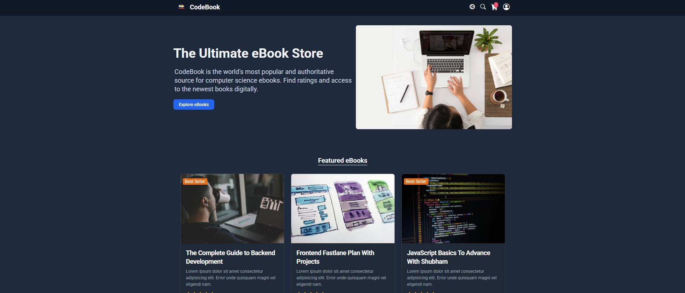
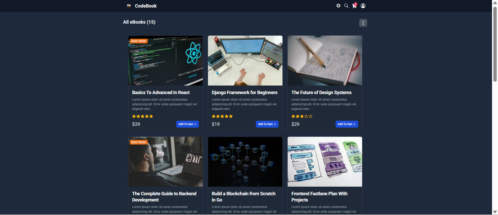
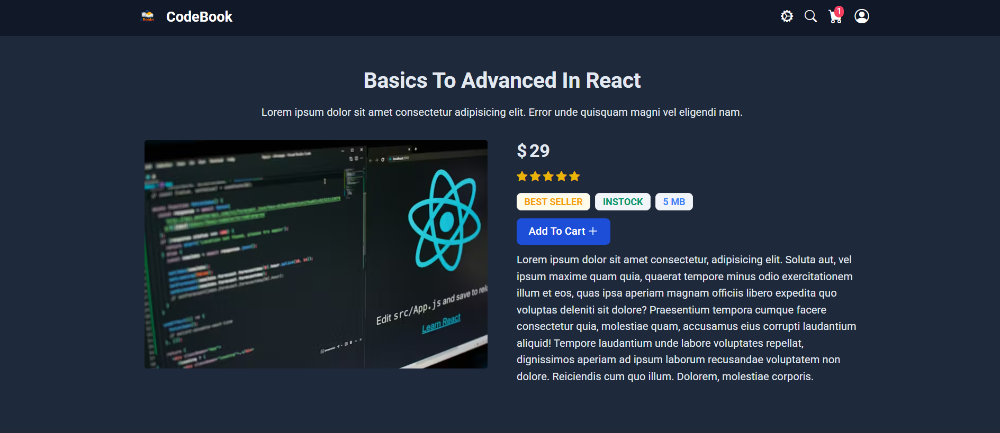
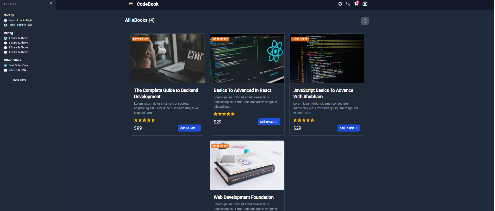
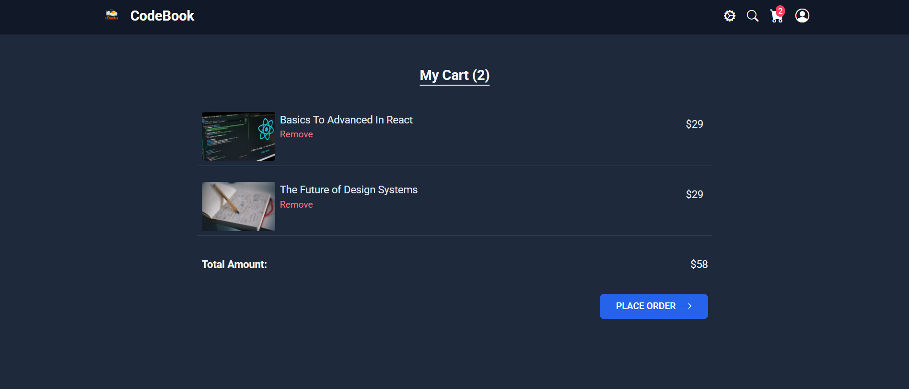
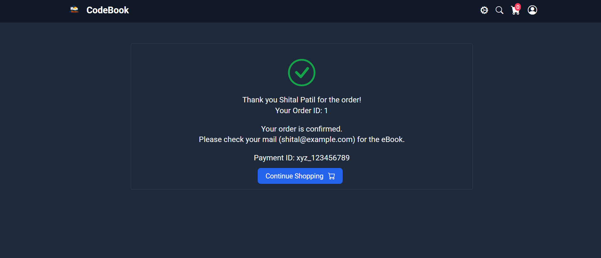
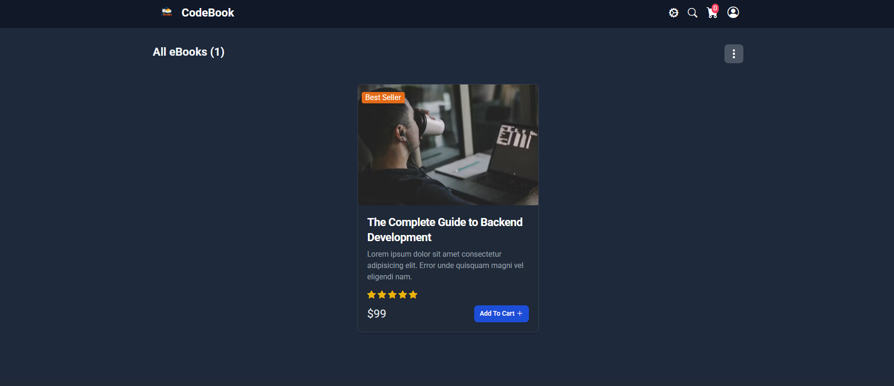

# 📚 CodeBook

CodeBook is a React-based mini e-commerce bookstore application that demonstrates modern front-end development practices including product browsing, filtering, sorting, shopping cart management, authentication, and a simulated checkout workflow.

🚀 Live Demo   🔗 https://codebook-s.netlify.app/

---

## Screenshots

### Homepage


### Products(Books) List Page


### Product Details Page


### Filter Products


### Cart Page


### Order Summary


### Search Functionality



---
## 🚀 Features

#### 📚 Book Browsing
Browse a collection of books displayed with cover images, titles, prices, and ratings in a clean grid layout.

#### 🔎 Search Functionality
Quickly search books by title or keyword with instant filtering of results.

#### 🎯 Smart Filtering
Filter books based on:
- ⭐ Rating
- 🔥 Best Sellers
- 📦 In-Stock Availability

#### ↕️ Price Sorting
Sort books based on price to easily find:
- Lowest priced books
- Highest priced books

#### 📖 Book Details Page
View detailed information about a book including description, rating, price, and availability.

#### 🛒 Shopping Cart
Add books to the cart, remove items, and manage selected books before checkout.

#### 📄 Cart Page
Displays all selected books with quantity, individual price, and total order value.

#### 📦 Order Summary
Shows a breakdown of the purchase including selected items and final total before payment.

#### 💳 Payment Popup
Simulated payment popup that allows users to confirm and complete their order.

#### 🔐 User Authentication
Includes login and registration functionality to simulate a user-based experience.

#### 👤 Guest Login
Allows users to explore the application and simulate purchases without creating an account.

#### 🧭 Routing with React Router
Smooth navigation between:
- Book listing
- Book details
- Cart page
- Login / Registration pages

#### 📱 Responsive Design
Fully responsive layout optimized for desktop, tablet, and mobile devices.

#### 🧩 Component-Based Architecture
Built using reusable React components for better scalability and maintainability.


---
## 🛠 Tech Stack

### Frontend
- ⚛️ **React** – Component-based UI development
- 🟨 **JavaScript (ES6+)** – Application logic
- 🌐 **HTML5** – Page structure
- 🎨 **CSS3** – Styling and layout

### Routing
- 🔀 **React Router** – Client-side navigation between pages

### State Management
- 🧠 **React Hooks** – Managing component state and side effects

### UI / Design
- 🎯 **Responsive Design** – Optimized for desktop, tablet, and mobile devices

### Development Tools
- 📦 **npm** – Dependency management
- 🧑‍💻 **VS Code** – Development environment

### Deployment
- 🌐 **Netlify** – Hosting and continuous deployment

---

## 📡 Data Source / Mock API

The application uses a **mocked REST API** to simulate a backend service for book data.  
The mock server is deployed on **Render**, allowing the frontend application to fetch book information just like a real production API.

- Backend Repository: https://github.com/shital1223/codebook-mock-server
- Deployment: Render

---

## ⚙️ Installation & Setup

1. **Clone the repository**
   ```bash
   git clone https://github.com/shital1223/Front-End-Projects.git

2. **Navigate to the Codebook project**
   ```bash
   cd Front-End-Projects/React/codebook
   
3. **Install dependencies**
   ```bash
   npm install

4. **Start the development server**
   ```bash
   npm start

5. Open http://localhost:3000 to view the app.
   
---

## 📂 Project Structure
``` codebook/
├── public/
├── src/
│   ├── components/      # Reusable UI components
│   ├── pages/           # Pages like Home, BookDetails etc.
│   ├── data/            # Book data
│   ├── hooks/           # Custom Hooks
│   ├── App.js
│   ├── index.js
│   └── App.css
│
├── screenshots/         # Project screenshots
├── package.json
└── README.md

```
---
## 👨‍💻 Author

**Shital Patil**

Software Engineer delivering high-quality applications while staying curious and up-to-date with emerging technologies.

- GitHub: https://github.com/shital1223
- LinkedIn: [https://www.linkedin.com/in/your-linkedin](https://www.linkedin.com/in/shital-patil-498372102/)
- Portfolio: Coming soon
