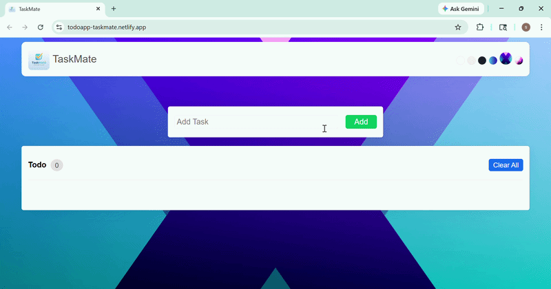
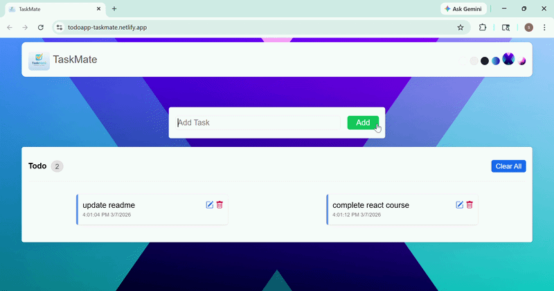
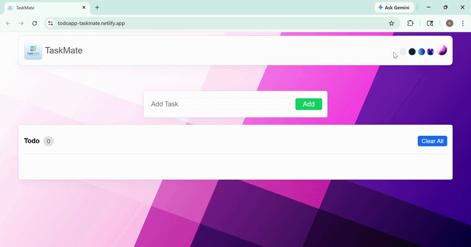

# 📚 TaskMate

TaskMate is a simple and clean React-based Todo application that helps users manage daily tasks efficiently.  
Users can quickly add tasks, view them in a list, and remove tasks once completed.

🚀 Live Demo  
🔗 https://todoapp-taskmate.netlify.app/

---

# 🎥 App Demo

### ➕ Add Task


### ❌ Remove Single Task


### 🧹 Clear All Tasks


### 🎨 Theme Toggle


---

## 🚀 Features

#### 📝 Add Tasks
Quickly add new tasks using the input field and keep track of daily activities.

#### 📋 Task List
All added tasks appear in a clean and organized list.

#### ❌ Remove Individual Tasks
Users can delete a single task once it is completed.

#### 🧹 Clear All Tasks
Clear the entire task list instantly with one click.

#### 🎨 Theme Switching
Users can switch between different UI themes for a better visual experience.

#### 💾 Persistent Todo Storage
All tasks are stored in **Local Storage**, ensuring that the task list remains available even after refreshing or reopening the browser.

#### ⚡ Instant UI Updates
Tasks update instantly using **React state** without requiring a page refresh.

#### 🧩 Component-Based Architecture
Built using reusable React components for better maintainability.

#### 📱 Responsive Design
Works smoothly across desktop and mobile devices.

---

## 🛠 Tech Stack

### Frontend
- ⚛️ **React**
- 🟨 **JavaScript (ES6+)**
- 🌐 **HTML5**
- 🎨 **CSS3**

### State Management
- 🧠 **React Hooks (useState)**

### Browser Storage
- 💾 **Local Storage API** – Persisting Todo tasks

### Development Tools
- 📦 **npm**
- 🧑‍💻 **VS Code**

### Deployment
- 🌐 **Netlify**

---

## ⚙️ Installation & Setup

1. **Clone the repository**
   ```bash
   git clone https://github.com/shital1223/Front-End-Projects.git

2. **Navigate to the Codebook project**
   ```bash
   cd Front-End-Projects/React/taskmate
   
3. **Install dependencies**
   ```bash
   npm install

4. **Start the development server**
   ```bash
   npm start

5. Open http://localhost:3000 to view the app.

---

## 📂 Project Structure
``` codebook/
taskmate/
├── public/
├── src/
│   ├── components/
│   ├── App.js
│   ├── index.js
│   └── App.css
│
├── screenshots/
│   └── gifs/
│       ├── add-task.gif
│       ├── remove-task.gif
│       ├── clear-task.gif
│       └── theme-toggle.gif
│
├── package.json
└── README.md
```
---
## 👨‍💻 Author

**Shital Patil**

Software Engineer delivering high-quality applications while staying curious and up-to-date with emerging technologies.

- GitHub: https://github.com/shital1223
- LinkedIn: [https://www.linkedin.com/in/your-linkedin](https://www.linkedin.com/in/shital-patil-498372102/)
